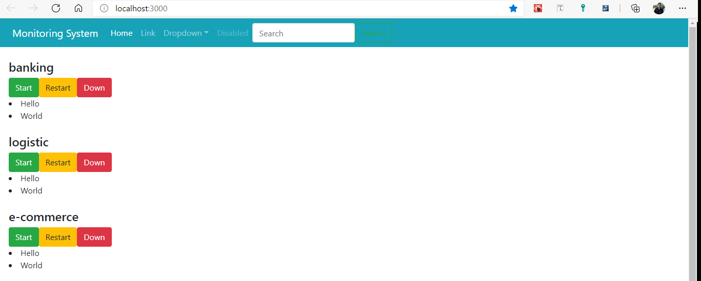

# Familar With React

ทดลองการใช้งาน React เบื้องต้น เพื่อให้คุ้นเคยกับ React ควรจะใช้ประกอบกับคู่มือหลักที่ [Reactjs.org](https://reactjs.org/docs/introducing-jsx.html) และ [Create React App](https://create-react-app.dev/docs/getting-started)

### Table of Content

1. [Basic Create React App](#basic-react)
2. [Components and Props](#components-and-props)
3. [การเรียกใช้ Function](#การเรียกใช้ฟังก์ชัน)
4. [การ Map Array](#mapping-from-array)



## Basic React

1. ทดลองสร้าง React App ด้วยตนเอง ด้วยการใช้ create-react-app command ตาม [Document ของ Create-react-app](https://create-react-app.dev/docs/getting-started) แนะนำให้ใช้ตัว npx หรือ `npx create-react-app ....` จากนั้นระบบจะให้ไฟล์ประมาณนี้

   ```
   my-app/
     README.md
     node_modules/
     package.json
     public/
       index.html
       favicon.ico
     src/
       App.css
       App.js
       App.test.js
       index.css
       index.js
       logo.svg
   ```

   เราจะ Focus ไปที่ `src/` เป็นหลัก ในส่วนของ `public/` จะเป็นส่วนของการแสดงผล `node_modules/` เราก็จะไม่ยุ่ง มันเป็นไฟล์จาก Library ต่าง ๆ ที่เราเรียกเข้ามา แล้วตรงนี้มันหนักมาก ควรจะเขียน `.gitignore` โฟลเดอร์ `node_modules ` นี้ไว้

2. ทดลองลง CSS Library ถ้ามีตัวไหนที่ใช้อยู่ ก็ให้ลงตัวที่ตัวเองถนัด ถ้ายังตัวอื่นไม่ได้ แนะนำให้เริ่มที่ [bootstrap](https://getbootstrap.com) ก่อน โดยเปิด Command อีกตัวหนึ่ง ให้เข้ามาที่ Root ของ Project ที่มีอยู่ (ระดับเดียวกันกับ ไฟล์ `package.json`) จากนั้นเริ่มลง โดย

   ```
   npm install bootstrap@next
   ```

   จากนั้นใน index.js ลบ

   ```
   import './index.css';
   ```

   ออก แล้วเราจะ import ของเราไปแทน แต่เราจะไปทำในไฟล์ App.js แทน

3. Import CSS และวาง Layout ใน App.js import CSS ของเราเข้ามา โดยวิธีการ Import , Import Module ยึดวิธีจาก [Style Guideline Import](https://github.com/lvarayut/javascript-style-guide#modules) นี้ โดยนอกจากเราจะ Import Module ทีเ่ป็นไฟล์ js,jsx มาแล้ว เราก็สามารถ import CSS มาได้ด้วย เช่น

   ```
   import 'bootstrap/dist/css/bootstrap.min.css'
   ```

   แล้วลองไปเอา Component ใน Document ของ Bootstrap มาวาง เช่น Button ลอง Comment บรรทัด `import 'bootstrap/....'` ไว้แล้วลองเทียบดู แล้ว uncomment กลับมา

[Back on Top](#Table-of-Content)

## Components and Props

ลองดูการใช้ Components กับ Props ประกอบกับ [Component and Props Official Doc](https://reactjs.org/docs/components-and-props.html)

1. ลองสร้างโฟลเดอร์ที่ชื่อว่า Components ขึ้นมา ใน `src/` จากนั้นลองสร้างไฟล์ Topbar.js ขึ้นมาใน `src/Components` แล้วสร้างไฟล์ร่าง ๆ ของ JSX ขึ้นมา ให้มีการ Return เป็น JSX HTML Element ออกไปเช่น

   ```
   //src/Components/Topbar.js
   import React from 'react';
   export default function Tobbar({}){
       return (<div>
           <h1> Hello This is topbar</h1>
       </div>)
   }
   ```

   แล้ว Import Component ตัวนี้เข้าไปใน App.js และเรียกใช้ Components นี้ เช่น

   ```
   import React from 'react';
   import Header from './Components/Topbar'

   export default function App(){
       return <div>
           <Header/>
       </div>
   }
   ```

   เวลาเราจะเรียก Component เราจะทำเหมือนกับว่ามันเป็น HTML Tag ใหม่ Tag หนึ่ง ที่มีโครงสร้างมากกว่า Tag ทั่ว ๆ ไป โดยใน JSX อย่าง React ถ้าสมมติว่าไม่มีข้อมูลตรงกลางระหว่าง Tag เราสามารถลดรูปได้ เช่น

   ```
   <div></div>
   ```

   สามารถเปลี่ยนเป็น

   ```
   <div/>
   ```

   ได้ เช่นเดียวกัน สามารถเขียน Header ในแบบ `<Header></Header>` ได้ แต่ไม่เป็นที่นิยม นิยมการเขียนแบบ `<Header/>` มากกว่า บันทึกแล้วลองดูผล

2. ลองนำ UI Component จาก Bootstrap เช่นพวก Navbar หรือตัวอื่น ๆ มาใส่ใน Header แต่จำไว้เสมอว่าอย่าลืมเปลี่ยน `class` เป็น `className` และทุก Tag ของ HTML มีเปิดแล้วต้องมีปิด ใน HTML ธรรมดา Tag บาทงตัวอาจจะไม่ต้องปิด เช่น `<br>`,`` แต่ใน jsx จำเป็นต้องปิด เช่น `<br/>`,`` และจะต้องถูกครอบเสมอ ในการ Return ออกมาเช่น จะต้องออกมาเป็น Component เดียว เช่น

   - แบบนี้จะ Error
     ```
     export default function Topbar(){
         return <div>This is My Header</div><div>Do you like my header?</div>
     }
     ```
   - แบบนี้จะ Run ได้

   ```
   export default function Topbar(){
       return <div>
           <div>This is My Header</div>
           <div>Do you like my header?</div>
           </div>
   }
   ```

3. ลองโยนค่าลงไปใน Component ของเรา การเขียน Component แบบนี้เราสามารถส่งข้อมูล หรือ ค่าของตัวแปรไปยัง Component ได้ เพื่อให้เราไม่ต้องมาสร้าง Component ใหม่ทุกครั้ง โดยค่าที่เราส่งไป เรียกว่า Props เราสามารถสร้างให้คอมโพเนนท์ของเรารับค่าได้ โดยการไปแก้ฟังก์ชั่นที่ Export Default ออกมา ให้รับค่าพารามิตอร์

   ```
   export default function Tobbar({subtitle}){
       return <nav>
           <h1> {subtitle} </h1>
       </nav>
   }
   ```

   โดยเราสามารถสร้างตังแปรได้ และนำค่านั้นมาแสดงด้วยการใช้ `{}` และลองเรียกใช้ Component จากที่พัฒนาไป เกิดอะไรขึ้นบ้าง ลองส่งค่าไปโดยใช้

   ```
   <Tobbar subtitle="สวัสดีเราคือ Subtitle">
   ```

   [Back on Top](#Table-of-Content)

## การเรียกใช้ฟังก์ชัน

1. ลองสร้าง Components เกี่ยวกับระบบมาสักอันหนึ่ง เช่นในตัวอย่างสร้าง ControlCard.js มา ให้มีปุ่ม หรือ อะไรบางอย่างอยู่ข้างใน รวมถึง การให้มีการรับค่าด้วย เช่น

   ```
   export default function ControlCard({title}){
    return(
       <div>
           <h1> {title} </h1>
           <button className="btn btn-success">Start</button>
           <button className="btn btn-warning"> Restart</button>
           <button className="btn btn-danger">Down</button>
       </div>
    )
   }
   ```

   แล้วเอา Component นี้มาวางไว้ในหน้า App.js ของเรา

2. ทำการสร้างฟังก์ชันขึ้นมาใน Components ของเรา (อยู่ใน export default function ControlCard(){... }) เช่นการสร้าง alert box โดยการสร้างเป็นฟังก์ชันแบบ JavaScript ทั่วไป หรือแบบ Arrow Function ก็ได้ แต่ Arrow Function จะได้รับความนิยมมากกว่า และเป็นวิธีที่ดีกว่า

   ```
   export default function ControlCard({title}){
       // เขียนแบบ function
       function alertStart(){
           window.alert('คณกำลังกด Start ' + title);
       }

       // เขียนแบบ Arrow Function
       const alertStart = ()=>{
           window.alert('คุณกำลังกด Start' +title);
       }

       return (...)
   }
   ```

   > เลือกแบบใดแบบหนึ่ง ถ้า Copy ไปทั้งสองมันจะมองว่าเป็นอันเดียวกัน แล้วมันจะเอาข้างล่างสุด

3. ทำการ Trigger การสั่งงานของฟังก์ชันเข้าไปใน HTML Event เช่น สมมติต้องการ ให้ทำตอน onClick ก็ใส่ลงไป โดยใช้ Arrow Function ในการเรียกภายใน เช่น

   ```
    <button className="btn btn-success" onClick={()=>alertStart()}>Start</button>
   ```

   การเรียกผ่าน Arrow Function แบบนี้ทำให้ระบบไม่ได้ทำงานทันทีเมื่อหน้าจอ Render แต่จะทำเมื่อมี event จริง ๆ ในทางกลับกันถ้าหากเราใส่ `onClick={alertStart()}` ฟังก์ชันนี้จะทำงานทันที แม้ว่าจะไม่ได้คลิกก็ตาม อย่างไรก็ดี ถ้าฟังก์ชันนั้นไม่ได้มี parameter เราก็สามารถเรียกในแบบ `onClick={alertStart}` โดยไม่มี () ได้เช่นกัน

4. ลองปรับปรุงจากตรงนี้ ให้มีการเรียกใช้ Function ที่มีการใส่ค่าพารามิเตอร์ไปได้
5. ลองทำให้มีการเรียกใช้ฟังก์ชัน ที่มีการ Return ออกมาเป็น HTML เช่น

   ```
     const showData = () => {
        return (
        <div>
            <li>Hello</li>
            <li>World</li>
        </div>
    )}
   ```

   แล้วเราอาจจะเรียกแบบให้มันรันตลอด แบบ {showData()} ก็ได้

[Back on Top](#Table-of-Content)

## Mapping from Array

Array เป็นวิธีหนึ่งที่ได้รับความนิยมในการเก็บข้อมูล และส่วนใหญ่เวลาจะส่งข้อมูลมาก็จะเป็น Array

1. ใน App.js ลองเรียกใช้ Component ตัวที่เราสร้างแบบนี้หลาย ๆ อัน
   ```
       <ControlCard title="Logistic">
       <ControlCard title="E-Commerce">
       <ControlCard title="Banking">
   ```
2. ลองสร้าง Array ของ title ขึ้นมาแทน (อยู่นอก Function Return นะ)
   ```
   const titleArray = ['Logistic','E-Commerce','Banking'];
   ```
3. แทนที่เราจะเรียกใช้ แบบตรง ๆ ในแบบเดิม มาเรียกใช้ผ่านการ Map Array เช่น

   ```
   return (
       <div>
       {titleArray.map(eachTitleArray=> (
           <ControlCard title={eachTitleArray}>
       ))}
       </div>
   )
   ```

   ลองสังเกตุผลการทดลองดู

   [Back on Top](#Table-of-Content)
