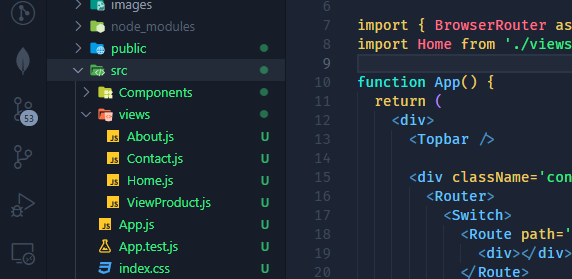

# Routing

- React เป็นการสร้าง Virtual Dom จริงๆ แล้วตัวของมันรันอยู่บน Single Page App การสร้าง Routing ต่าง ๆ จึงเหมือนกับเป็น Routing เสมือน
- สามารถสร้าง Routing ใน React ได้หลายวิธี ตัวที่จะอยู่ในชุดนี้คือ React Router 6.4 ส่วนโค้ดหลักๆ ของศูนย์ก็จะใช้ React Router เหมือนกัน โดยมักจะเป็น React Router Version 5

## เริ่มสร้างระบบที่มี React Router

- Create React App มาใหม่ หรือใช้โปรเจกต์เดิมก็ได้ จากนั้นติดตั้ง React Router

```
npm install --save react-router
```

- สร้าง Directory หรือ Folder ขึ้นมา เพื่อที่จะเก็บหน้าเพจต่างๆ จริงๆ แล้วมันไม่ได้จำเป็น เพราะ React เป็นลักษณะของ Library ไม่ได้มีการบังคับ แต่เป็นที่นิยมในวงการ React โดยแนะนำให้ใช้ว่า `pages` , `views` หรือ `containers`
- เอา Logic ต่าง ๆ ออกจากหน้าแรก และเปลี่ยนหน้าแรกเป็น Router
- ทดลองสร้างหน้าเปล่า ๆ ขึ้นมาใน Directory ที่เก็บหน้า เช่น `About.js`, `Contact.js`, `ViewProduct.js` รวมถึงหน้า `Home.js` เข้ามาใน React ไฟล์ที่เป็นไฟล์ที่มีการ Return HTML Component ออกมาต้องขึ้นต้นด้วยตัวใหญ่ แล้ว Import หน้าพวกนี้เข้ามาในหน้า App.js (จะสร้างเป็น `.js` หรือ `.jsx` ก็ได้)



- Import ไฟล์เข้ามาที่หน้าหลักของ App.js แล้วสร้างโครงของ React Router ขึ้นมา

```jsx
import { BrowserRouter as Router, Route, Switch } from 'react-router-dom'
import Home from './views/Home'
import About from './views/About'
import Contact from './views/Support'

export default function App() {
  return (
    <Router>
      <Switch>
        <Route path='/about'>
          <About />
        </Route>
        <Route path='/contact'>
          <Contact />
        </Route>
        <Route path='/'>
          <Home />
        </Route>
      </Switch>
    </Router>
  )
}
```

- ลองสร้าง
